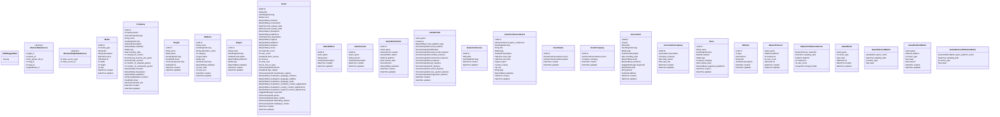

```mermaid
classDiagram

    class UUIDTaggedItem {
        -Tag tag
    }
    
    class AbstractDataSource {
        <<abstract>>
        int igdb_id
        int steam_id
        int the_games_db_id
        int mbg_id
        int rawg_id
        int giantbomb_id
    }
    
    class AbstractSingleDataSource {
        <<abstract>>
        int data_source_type
        int data_source_id
    }
    
    class Media {
        UUID id
        int media_type
        String title
        String description
        FileField source
        URLField url
        int width
        int height
        int size
        DateTime created
        DateTime updated
    }
    
    class Company {
        UUID id
        Company parent
        ChoiceArrayField type
        String name
        AutoSlugField slug
        TextField description
        ManyToMany websites
        Media logo
        Date founding_date
        int employees_number
        Decimal avg_revenue_per_game
        Decimal total_revenue
        int number_of_released_games
        int number_of_unreleased_games
        ManyToMany founders
        ManyToMany developers
        ManyToMany publishers
        String headquarters_location
        EmailField email
        URLField presskit_link
        DateTime created
        DateTime updated
    }
    
    class People {
        UUID id
        String name
        Media photo
        AutoSlugField slug
        EmailField email
        ChoiceArrayField roles
        TextField bio
        DateTime created
        DateTime updated
    }
    
    class Platform {
        UUID id
        String name
        AutoSlugField slug
        String alternative_name
        int category
        int generation
        Media logo
        TextField summary
        ManyToMany websites
        int year_start
        int year_end
        DateTime created
        DateTime updated
    }
    
    class Engine {
        UUID id
        String name
        AutoSlugField slug
        TextField description
        ManyToMany platforms
        Media logo
        ManyToMany websites
        DateTime created
        DateTime updated
    }
    
    class Game {
        UUID id
        String title
        AutoSlugField slug
        Media cover
        ManyToMany artworks
        ManyToMany screenshots
        DateTime first_release_date
        DateTime last_release_date
        ManyToMany developers
        ManyToMany publishers
        TextField short_description
        ManyToMany engines
        ManyToMany platforms
        ManyToMany websites
        ManyToMany stores
        int metacritic_score
        int user_score
        ArrayField other_names
        int revenue
        int units_sold
        bool is_free_to_play
        ChoiceArrayField themes
        ArrayField age_ratings
        ChoiceArrayField monetization_options
        ManyToMany localization_language_interface
        ManyToMany localization_language_subtitles
        ManyToMany localization_language_audio
        ManyToMany localization_continent_content_adjustments
        ManyToMany localization_country_content_adjustments
        ManyToMany localization_regional_content_adjustments
        TaggableManager keywords
        ChoiceArrayField genres
        ChoiceArrayField game_modes
        ChoiceArrayField networking_options
        ChoiceArrayField multiplayer_modes
        DateTime created
        DateTime updated
    }
    
    class GameEdition {
        UUID id
        Game game
        String name
        TextField description
        DateTime created
        DateTime updated
    }
    
    class GameVersion {
        UUID id
        Game game
        String version
        TextField description
        DateTime created
        DateTime updated
    }
    
    class GameDistribution {
        UUID id
        Game game
        GameVersion version
        GameEdition edition
        Platform platform
        Date release_date
        Decimal price
        ManyToMany websites
        DateTime created
        DateTime updated
    }
    
    class GameProfile {
        Game game
        int latency
        ManyToMany cross_platform_play
        ChoiceArrayField social_features
        ChoiceArrayField difficulties
        ChoiceArrayField assist_mode_features
        ChoiceArrayField narrative_features
        ChoiceArrayField environment_features
        ChoiceArrayField ai_features
        ChoiceArrayField ugc_features
        ChoiceArrayField dlc_features
        ChoiceArrayField control_features
        ChoiceArrayField save_system_features
        ChoiceArrayField progression_features
        DateTime created
        DateTime updated
    }
    
    class GameConference {
        UUID id
        String title
        AutoSlugField slug
        DateTime created
        DateTime updated
    }
    
    class GameConferenceEvent {
        UUID id
        GameConference game_conference
        AutoSlugField slug
        String title
        Media logo
        TextField description
        DateTime start_time
        DateTime end_time
        Region region
        Country country
        City city
        String type
        ManyToMany websites
        DateTime created
        DateTime updated
    }
    
    class EventGame {
        UUID id
        GameConferenceEvent event
        GameConferenceEvent game
        DateTime created
        DateTime updated
    }
    
    class EventCompany {
        UUID id
        GameConferenceEvent event
        Company company
        DateTime created
        DateTime updated
    }
    
    class Association {
        UUID id
        int type
        String title
        AutoSlugField slug
        Media logo
        TextField description
        Date founding_date
        ManyToMany team
        ManyToMany members
        TaggableManager keywords
        EmailField email
        String phone
        TextField address
        DateTime created
        DateTime updated
    }
    
    class AssociationCompany {
        UUID id
        Association association
        Company company
        Date date_joined
        Date date_left
        DateTime created
        DateTime updated
    }
    
    class Store {
        UUID id
        String name
        AutoSlugField slug
        Website website
        Media logo
        Company company
        Date release_date
        ManyToMany supported_platforms
        DateTime created
        DateTime updated
    }
    
    class Website {
        UUID id
        int type
        URLField url
        String title
        TextField description
        DateTime created
        DateTime updated
    }
    
    class MetacriticScore {
        Game game
        Platform platform
        int metascore
        int user_score
        URLField url
        DateTime created
        DateTime updated
    }
    
    class MetacriticHistoricalScore {
        MetacriticScore metacritic
        DateTime sampling_date
        Platform platform
        int metascore
        int user_score
        ArrayField changed_fields
    }
    
    class GameMetric {
        Game game
        int metric_type
        float value
        URLField url
        DateTime created
        DateTime updated
    }
    
    class GameHistoricalMetric {
        GameMetric game_metric
        DateTime sampling_date
        int metric_type
        float value
    }
    
    class GamePlatformMetric {
        Game game
        Platform platform
        int metric_type
        float value
        URLField url
        DateTime created
        DateTime updated
    }
    
    class GameHistoricalPlatformMetric {
        GamePlatformMetric game_platform_metric
        DateTime sampling_date
        int metric_type
        float value
    }

```